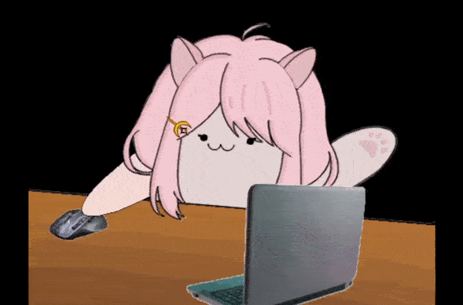

Michi Vtuber con Java.
======================

## Acerda de
Este programa genera una animación simple de un gato que tiene movimientos de acuerdo a las actividades en tiempo real con el ratón, teclado y micrófono de la computadora.

  

Se creó con el propósito de ser usado por un streamer de twitch como un regalo, no esperando una compensación a cambio. Por otro lado, cualquiera que lo desee puede modificar este programa para su propio uso.

## Uso
Nótese que al ser un programa de Java, requiere que tengan Java Runtime Environment (JRE). La versión recomendada generalmente es Version 8. Puede ser enconttrada en la propia [página de Java](https://www.java.com/es/download/manual.jsp)

### Compilación
Para compilar el programa use cualquiera de los scripts proporcionados, ya sea `program.bat` para el SO Windows o `program.sh` para SO afines a Unix.

### Ejecutable
La versión más actual del programa (1.0.0) puede ser encontrada en la pestaña de [lanzamientos](https://gitlab.com/rnunovaldes/vtube-michi/-/releases/1.0.0) en la [página del proyecto](https://gitlab.com/rnunovaldes/vtube-michi).

### Antes de la ejecución
En la carpeta `/res` se encuentra el archivo `config.properties` en el cual se pueden establecer distintos parámetros para el programa, que no pueden ser cambiados durante el tiempo de ejecución, los cuales son:
 * `window_height` Indica el alto de la ventana en píxeles. Debe ser un número natural.
 * `window_width` Indica el ancho de la ventana en píxeles. Debe ser un número natural.
 * `window_location` Indica donde se va a iniciar la ventana. Puede ser `ne` para noreste, `nw` para noroeste, `se` para sureste o `sw` para suroeste.
 * `windows_taskbar_height` Indica que tan grande es la altura en píxeles la barra de tareas para poder colocar inicialmente la ventana del programa sin que se solape con esta. Debe ser un número natural.
 * `mouse_detection` Indica si se va a registrar el movimiento del ratón o no. Deber ser `true` o `false`.
 * `keyboard_detection` Indica si se va a registrar las acciones del teclado o no. Deber ser `true` o `false`.
 * `microphone_detection` Indica si se va a registrar la intensidad del sonido proveniente del micrófono. Deber ser `true` o `false`.
 * `microphone_channels` Indica cuantos canales tiene el micrófono, o sea, si es mono, estereo, quad, etc. Es ignorado si `microphone_detection=false`. Debe ser un número natural.
 * `microphone_ups` Indica cuantas veces por segundo se comprueba el micrófono, principalmente para ahorrar recursos de la computadora. Es ignorado si `microphone_detection=false`. Debe ser un número natural.
 * `microphone_threshold` Indica La intensidad de los sonidos provenientes del micrófono para ser considerados por la detección de sonido. Es ignorado si `microphone_detection=false`. Debe ser un número natural.
 * `frames_per_second` Indica cuantos fotogramas son pintados por segundo, principalmente para ahorrar recursos de la computadora. Debe ser un número natural.

 En caso de que este archivo sea eliminado, modificado incorrectamente, corrompido o inaccesible, se creará uno nuevo o modificará el existente para que pueda ser usado de nuevo con los valores por defecto para los parámetros afectados.

 ### En tiempo de ejeción
Mientras la ventana esté activa puede registrar el teclado, ratón y micrófono del usuario si lo indicó en el `config`, y si además esta ventana tiene el foco principal, tiene 2 atajos del teclado:
 * Terminar el programa: Si se pulsa la secuencia de botones `CTRL-SHIFT-C` en ese orden, ya sea manteniendolos presionados o cada uno por separado, el programa termina.
 * Activar decoracion: Si se pulsa la secuencia de botones `CTRL-SHIFT-D` en ese orden, ya sea manteniendolos presionados o cada uno por separado, se activan los bordes de la ventana, permitiendo el movimiento de esta a la ubicación deseada, además de colocar un fondo color verde RGB(0, 255, 0).

## Programa

  
  
Programado con Java 17

aunque no utiliza caracteristicas de esta versión, por lo que puede ser usado con Java 8.

Se usa la versión más actual de JNativeHook hasta la fecha de Marzo 02 del 2024. Este proyecto tiene un directorio `/libs` con `jnativehook-2.2.2.jar` dentro de él. Más información u otras versiones pueden ser encontradas en la página de GitHub para [JNativeHook](https://github.com/kwhat/jnativehook). Esta librería tiene la [Licencia Pública General Reducida de GNU (LGPL)](https://www.gnu.org/licenses/lgpl-3.0.html), y no fue modificada para este proyecto.
